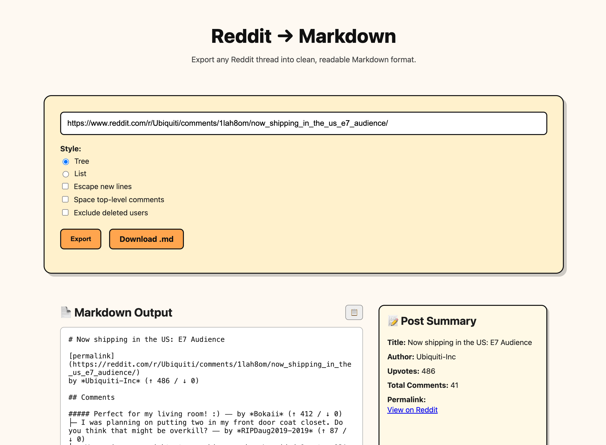

# Reddit Markdown Exporter

Export Reddit threads (posts + comments) into clean and readable **Markdown format**.

## 🌐 Live Demo

Try it instantly in your browser: [Reddit Markdown Exporter](https://grigorkh.github.io/reddit-markdown-exporter/)

## ✨ Features

- Export Reddit post + comments to Markdown
- Choose export style: Tree or List
- Optional: Escape new lines and space top-level comments
- Download Markdown as a `.md` file

## 🛠 How to Use

1. Paste a Reddit post URL
2. Choose options
3. Click **Export**
4. Download and save your Markdown!

---

MIT License
